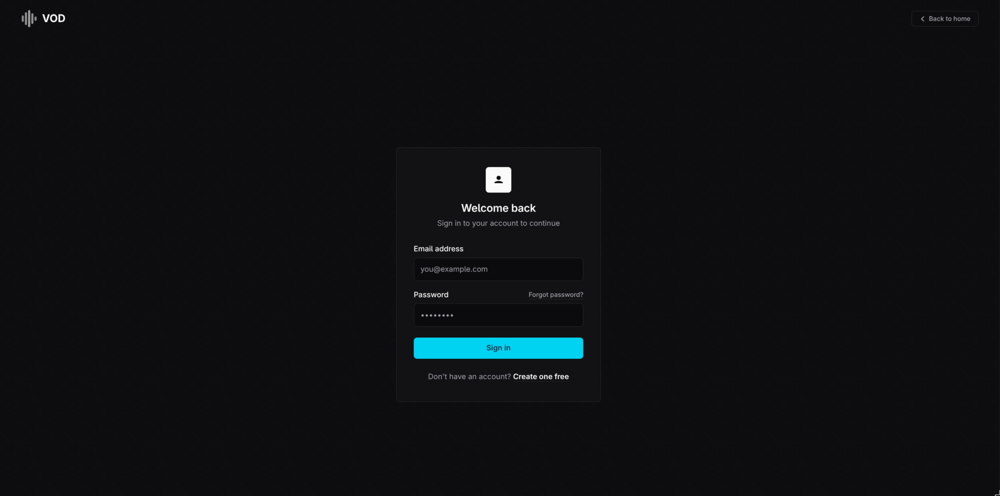
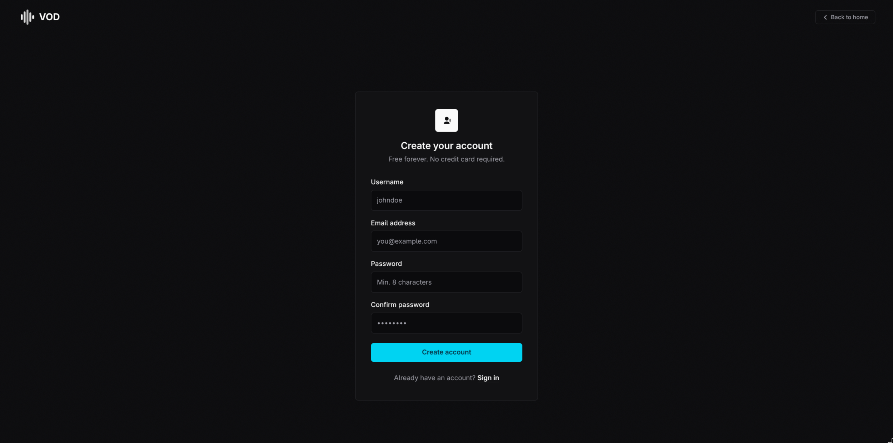
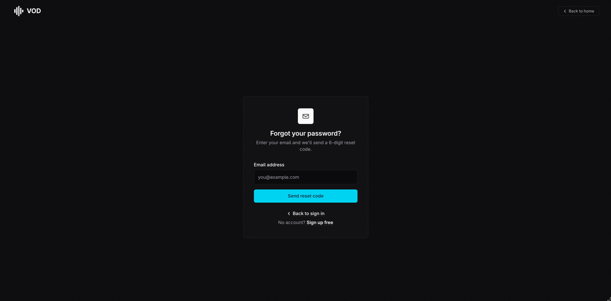
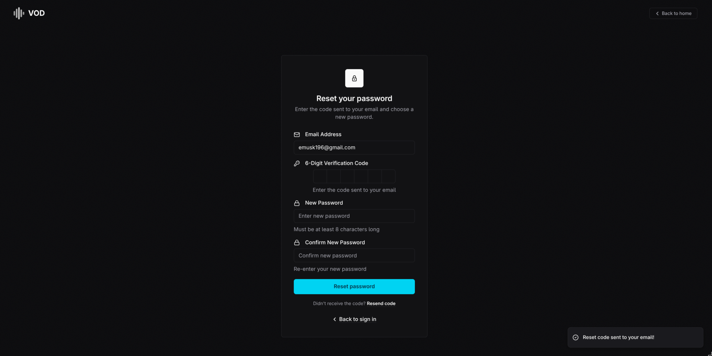
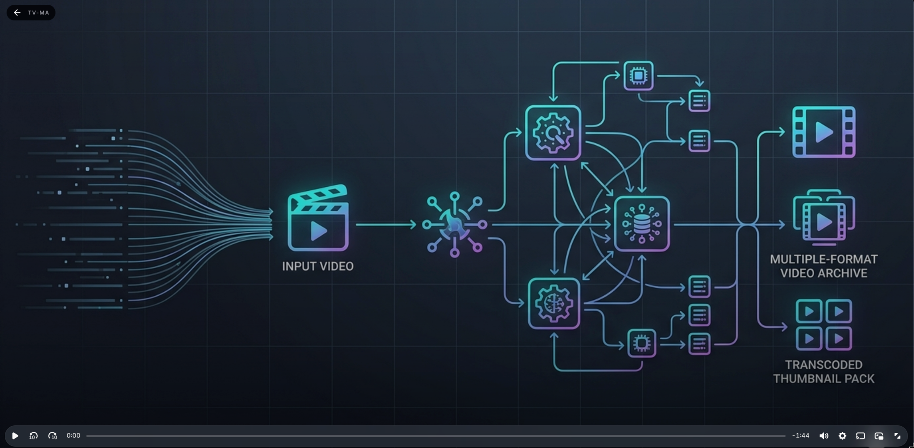
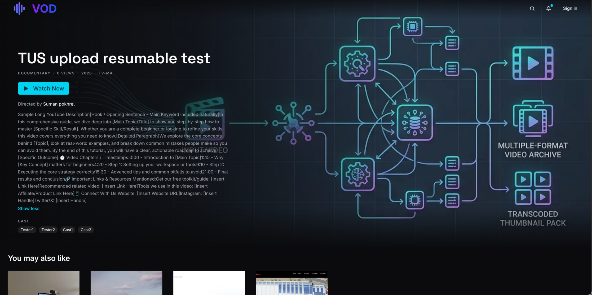
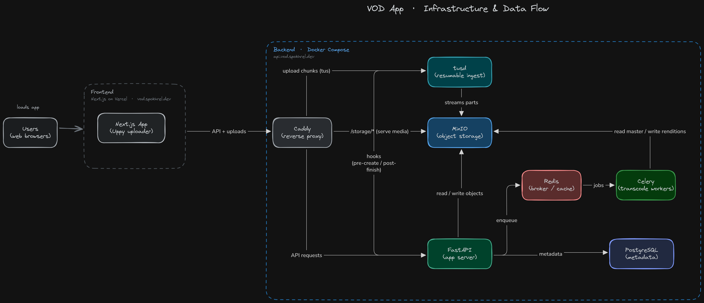

<div align="center">

# VOD

**Self-hosted video-on-demand platform. Upload once, transcode to adaptive HLS, and stream from infrastructure you control.**

[](LICENSE)
[](https://nextjs.org/)
[](https://fastapi.tiangolo.com/)
[](https://www.postgresql.org/)
[](https://docs.celeryq.dev/)

[Live demo](https://vod.spokhrel.dev) · [Deploy your own](#deploy-your-own) · [Architecture](#architecture)


</div>

## What this is

Putting video online usually means handing it to a platform: unlisted YouTube links, Vimeo's paywalls, or a CDN bill that scales with every view. You inherit their player, their recommendation logic, their terms of service, and no say over encoding, storage, or takedowns.

VOD is a complete alternative you run yourself. Admins upload through a resumable, network-drop-safe uploader. A Celery and FFmpeg pipeline transcodes the file to seven HLS quality levels and builds scrubbing-preview thumbnails in the background, while a Next.js frontend serves a public browse feed and a custom video.js player. PostgreSQL holds the metadata, MinIO holds the bytes, and Caddy is the single entry point. It's built to run on a small VPS. This repo's own production deployment runs the entire backend on a droplet with under 4 GiB of RAM.

The live demo at [vod.spokhrel.dev](https://vod.spokhrel.dev) is a real deployment of this exact repository, not a hosted mockup.

## Features

### Streaming
- Adaptive HLS playback across 7 quality levels, 144p to 1440p (2160p/4K is implemented but commented out of the pipeline to keep dev transcodes fast)
- Custom video.js player (`@videojs/react`) on a dedicated, chrome-free `/play/[video_id]` route, separate from the `/watch/[video_id]` detail page
- Scrubbing-preview thumbnails, built during processing as a sprite sheet and WebVTT storyboard, and parsed by the player itself
- Video bytes (manifests, segments, thumbnails) are served directly from object storage through Caddy, never proxied through the Python process
- Public browse feed and watch pages that don't require an account

### Processing
- Celery chain: prepare, generate a scrubbing storyboard (best-effort and isolated, so a failure here can't break transcoding), transcode all 7 qualities in parallel (a Celery chord), segment into 6-second HLS chunks, build the manifest, upload to object storage, and finalize
- Per-transcode FFmpeg thread count is configurable (`FFMPEG_THREADS`)
- Soft delete, which hides a video everywhere without touching its row or its files
- Public/private visibility toggle, independent of delete

### Platform
- JWT auth with access and refresh tokens. Refresh tokens are stored in the database so sessions can be revoked
- Email verification and password reset via Resend
- Resumable uploads (tusd + Uppy), feature-flagged via `uploads_tus_enabled` (on by default), with a legacy multipart fallback (`POST /videos/create`) when the flag is off
- Upload admission control that caps concurrent resumable uploads and expires abandoned admission slots after a configurable TTL
- Role-based access control (`user` / `admin`), with every admin video-management endpoint gated on the admin role
- Short-lived presigned download URLs for the original source file

## Screenshots

| | |
|---|---|
| <br>Sign in | <br>Create an account |
| <br>Forgot password | <br>Reset password |
| <br>Full-screen player (`/play/[video_id]`) | <br>Watch detail page (`/watch/[video_id]`) |

## Architecture

```
Browser
   │  HTTPS
   ▼
Caddy  ── /storage/* ──▶ MinIO (object storage)
   │  ── /files/*    ──▶ tusd (resumable uploads) ──▶ MinIO
   │
   │  everything else
   ▼
FastAPI ──▶ PostgreSQL
   │
   │  enqueue job
   ▼
Redis ──▶ Celery worker ──▶ FFmpeg ──▶ MinIO
```



*The live demo's actual deployment: frontend on Vercel, backend stack on a single droplet.*

Caddy is the only public ingress. Everything under `/storage/*` is reverse-proxied straight to MinIO's S3 API, and everything under `/files/*` goes to tusd. Both bypass FastAPI entirely, so a video segment request never touches Python. Caddy just hands back bytes from a disk-backed object store, with cache headers set per file type: HLS segments get `max-age=31536000, immutable` since they never change once written, manifests get a 60-second cache since a re-processed video needs its playlist to refresh promptly, and thumbnails get a week. `/internal/*` is blocked at the edge except for the one JWT-protected status route the frontend polls. The shared secret that authenticates tusd's own webhook calls to the API never crosses the public internet, since tusd calls the API directly over the Docker network.

Everything else (auth, video CRUD, admin endpoints) goes to FastAPI, which reads and writes PostgreSQL and enqueues background work onto Redis. The upload-to-publish flow works like this: an admin uploads through tusd or the legacy multipart endpoint, either way creating a `Video` row and dispatching a Celery chain that prepares the file, generates the storyboard, transcodes all seven qualities in parallel, segments the output, builds the manifest, uploads it, and finalizes. The frontend polls `GET /videos/{id}/status` while this runs, and the video is watchable the moment the chain completes.

For the design rationale behind this, see the full write-up: [spokhrel.dev/projects/proj-vod](https://spokhrel.dev/projects/proj-vod).

## Deploy your own

### Requirements
- A server with Docker and the Compose plugin (`docker compose`). This repo's own production deployment runs the entire backend (Postgres, Redis, MinIO, tusd, the API, and a Celery worker) on a droplet with 3.72 GiB RAM and 2 GB swap. Treat that as a practical floor.
- A domain (or subdomain) with an A record pointed at the server, for Caddy's automatic TLS.
- Node.js 20.9+ if you're building the frontend yourself instead of using a platform like Vercel.

### Clone and configure
```bash
git clone <this-repo-url>
cd vod-app
cp infra/.env.example infra/prod.env
```

Edit `infra/prod.env`. Variables you **must** change:

| Variable | Why |
|---|---|
| `POSTGRES_PASSWORD` | Database password |
| `MINIO_ROOT_USER` / `MINIO_ROOT_PASSWORD` | Object storage root credentials |
| `minio_access_key` / `minio_secret_key` | The same MinIO credentials, read by the app (pydantic Settings, lowercase) |
| `REDIS_PASSWORD` | Broker/cache password |
| `SECRET_KEY` / `jwt_secret_key` | App and JWT signing secrets, each generated with `openssl rand -hex 32` |
| `tus_hook_shared_secret` | Authenticates tusd's webhook calls to the API, required once `uploads_tus_enabled=true` |
| `RESEND_API_KEY` / `from_email` | Transactional email. `from_email` must match a domain verified in Resend |
| `FRONTEND_URL` | Used in verification and reset email links, set to your real frontend origin |
| `CORS_ALLOW_ORIGINS` / `ALLOWED_HOSTS` | Must list your actual domain(s), not `localhost` |

> Several of these credentials appear more than once in the file under different names. `POSTGRES_PASSWORD` is also embedded in `DATABASE_URL` and `DATABASE_URL_SYNC`. `MINIO_ROOT_USER` and `MINIO_ROOT_PASSWORD` must match `minio_access_key` and `minio_secret_key`. `REDIS_PASSWORD` is also embedded in `REDIS_URL`, `CELERY_BROKER_URL`, and `CELERY_RESULT_BACKEND`. Change every occurrence. A mismatch breaks one service at a time instead of the whole stack, which makes it a slow bug to chase.

### Caddy
```bash
cp infra/caddy/Caddyfile.prod.example infra/caddy/Caddyfile.prod
```
Open it and replace `api.yourdomain.com` with your own domain. That's the only line you need to change. It routes `/storage/*` to MinIO with per-file-type cache headers, `/files/*` to tusd, blocks the rest of `/internal/*`, and proxies everything else to FastAPI.

### Start the stack
```bash
cd infra
docker compose -f docker-compose.yml --env-file prod.env up -d --build
```
`docker-compose.yml` interpolates several `${...}` variables (bucket names, MinIO keys, the tus shared secret) at parse time, so `--env-file prod.env` is required. The `env_file:` entries inside the compose file only inject variables into the containers, not into compose's own variable substitution.

### Verify TLS and health
Because the Caddyfile's site address is a real hostname instead of `:80`, Caddy requests and renews a Let's Encrypt certificate automatically on first boot. There's nothing else to configure, but DNS must already resolve to the server.
```bash
curl https://api.yourdomain.com/health/
# {"status":"Ok!"}
```

### Make processed output public
Playback streams straight from MinIO through Caddy's `/storage/*` proxy with no signing, so the buckets holding HLS output and thumbnails need public read. The bucket holding original uploads stays private. Admins reach it only through short-lived presigned URLs.
```bash
docker run --rm --network host minio/mc alias set local http://127.0.0.1:9000 <MINIO_ROOT_USER> <MINIO_ROOT_PASSWORD>
docker run --rm --network host minio/mc anonymous set download local/vod-processed
docker run --rm --network host minio/mc anonymous set download local/vod-thumbnails
```

### Promote your first admin
Sign up an account through the frontend, then:
```bash
cd infra
docker compose -f docker-compose.yml --env-file prod.env exec postgres \
  psql -U vod_user -d vod_db -c "UPDATE users SET role = 'ADMIN' WHERE email = 'you@example.com';"
```

### Deploy the frontend
`docker-compose.yml` here covers the backend only. There's no Next.js service in it. Deploy `app/` separately (Vercel, or `pnpm build && pnpm start` on any Node host), and set:
```
NEXT_PUBLIC_API_URL=https://api.yourdomain.com
```
Also add your domain to `images.remotePatterns` in `app/next.config.ts`. It currently only allow-lists the demo's own storage host, and without your own domain there Next's `<Image>` will refuse to render thumbnails.

### Keeping it updated
The frontend redeploys itself. Vercel rebuilds on every push to `main`. For the backend, SSH into the server and pull plus rebuild:
```bash
cd vod-app && git pull
cd infra && docker compose -f docker-compose.yml --env-file prod.env up -d --build
```

## Local development

```bash
git clone <this-repo-url>
cd vod-app
cp infra/.env.example infra/local.env
cp infra/caddy/Caddyfile.example infra/caddy/Caddyfile.local
make dev
```

> **`NEXT_PUBLIC_API_URL` must point at Caddy (port 80), not the API container directly (port 8000).** Video and thumbnail URLs are built client-side as `${NEXT_PUBLIC_API_URL}/storage/...` (`app/lib/utils/storage.ts`), and only Caddy proxies `/storage/*` to MinIO. The API on `:8000` doesn't. Pointing at `:8000` breaks every thumbnail and every playback, and it fails silently: that helper has no fallback, so an unset variable renders `undefined/storage/...` in the browser.

```bash
cd app
pnpm install
pnpm dev
```
Create `app/.env.local`:
```
NEXT_PUBLIC_API_URL=http://localhost
```

| Service | URL | Credentials |
|---|---|---|
| App (via Caddy) | http://localhost | - |
| Frontend dev server | http://localhost:3000 | - |
| Swagger / OpenAPI | http://localhost/docs | - |
| MinIO console | http://localhost:9001 | minioadmin / minioadmin123 |
| pgAdmin | http://localhost:5050 | admin@local.dev / admin |
| Flower (Celery) | http://localhost:5555 | - |
| RedisInsight | http://localhost:5540 | - |

The `api` container mounts `../backend:/app` and runs `uvicorn --reload`, so API changes pick up live. The `worker` container does **not** mount the source. It only has what was baked in at `docker build` time, so any change to a Celery task needs a rebuild, not a restart:
```bash
make build
```

## Tech stack

| Layer | Choice |
|---|---|
| Frontend | Next.js 16 (App Router), React 19, TypeScript, Tailwind CSS v4 |
| Player | video.js via `@videojs/react`, custom skin |
| State | Zustand (auth), TanStack Query (server state) |
| Backend | FastAPI, SQLAlchemy (sync/psycopg2), Alembic, Pydantic Settings |
| Database | PostgreSQL 16 |
| Queue | Celery + Redis 7 |
| Object storage | MinIO (S3-compatible) |
| Uploads | tusd + Uppy (resumable), legacy multipart fallback |
| Reverse proxy | Caddy 2 |
| Media | FFmpeg, H.264 to HLS across 7 quality levels |
| Email | Resend |

## Roadmap

- [ ] AI features: automatic transcription, chapter detection, semantic search
- [ ] Pluggable storage backends for CDN-backed delivery (S3 + CloudFront, R2, etc.), beyond MinIO-only
- [ ] Automated tests and CI
- [ ] Comments (removed during a redesign, no UI or backend exists today)
- [ ] Admin user-management and analytics backends (the panels exist, the endpoints don't)
- [ ] Docker health checks, so `depends_on` waits for readiness instead of just container start

## Contributing

Issues and pull requests are welcome. Contributions are accepted under this project's AGPL-3.0 license.

## License

[AGPL-3.0](LICENSE). Free to use, modify, and self-host. If you run a modified version as a network service, you must publish your modified source under the same license.
