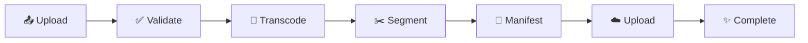

# 🎬 Video Processing Pipeline

## 📋 Overview

This pipeline transforms raw video uploads into adaptive bitrate HLS streams, enabling seamless playback across different devices and network conditions.



## 🏗️ Architecture

### Technology Stack

| Component | Technology | Purpose |
|-----------|-----------|---------|
| **API Framework** | FastAPI | HTTP endpoints & request handling |
| **Task Queue** | Celery + Redis | Async job processing |
| **Video Processing** | FFmpeg | Transcoding & segmentation |
| **Object Storage** | MinIO | File storage & delivery |
| **Database** | PostgreSQL | Metadata & status tracking |

### Why This Stack?

- **FastAPI**: Non-blocking async I/O for high throughput
- **Celery**: Battle-tested distributed task queue
- **Redis**: Lightning-fast message broker
- **FFmpeg**: Industry-standard video processing
- **MinIO**: S3-compatible, self-hosted storage

---

## 🔄 Processing Workflow

### Stage 1️⃣: Preparation
```python
prepare_video(video_id)
```
- ✅ Validate video exists in database
- 📥 Download raw file from MinIO
- 🔍 Extract metadata (duration, resolution, codec)
- 📂 Create temporary working directory

**Output**: `{ video_id, work_dir, raw_file_path, metadata }`

---

### Stage 2️⃣: Transcoding (Parallel)
```python
chord(
    group(
        transcode_quality("1080p"),
        transcode_quality("720p"),
        transcode_quality("480p"),
        transcode_quality("360p")
    ),
    on_transcode_complete()
)
```

#### Why Parallel?
| Sequential | Parallel |
|------------|----------|
| ⏱️ 20 minutes | ⚡ 5 minutes |
| 1 worker | 4 workers |
| 4x slower | 4x faster |

**Quality Profiles**:
- **1080p**: 5000 kbps, H.264, AAC 192k
- **720p**: 2500 kbps, H.264, AAC 128k
- **480p**: 1000 kbps, H.264, AAC 96k
- **360p**: 600 kbps, H.264, AAC 64k

**Output**: `{ video_id, transcoded_files: {...} }`

---

### Stage 3️⃣: Segmentation
```python
segment_videos(data)
```
- ✂️ Split each quality into 10-second HLS chunks
- 📦 Generate `.ts` segment files
- 🎯 Maintain playback continuity

**Example Structure**:
```
/segments/
  ├── 1080p/
  │   ├── segment_001.ts
  │   ├── segment_002.ts
  │   └── ...
  ├── 720p/
  └── ...
```

**Output**: `{ video_id, segmented_files: {...} }`

---

### Stage 4️⃣: Manifest Creation
```python
create_manifest(data)
```
- 📝 Generate master playlist (`master.m3u8`)
- 📝 Generate media playlists per quality
- 🎚️ Define bitrate ladder

**Master Playlist**:
```m3u8
#EXTM3U
#EXT-X-STREAM-INF:BANDWIDTH=5000000,RESOLUTION=1920x1080
1080p/playlist.m3u8
#EXT-X-STREAM-INF:BANDWIDTH=2500000,RESOLUTION=1280x720
720p/playlist.m3u8
...
```

**Output**: `{ video_id, manifest_paths: {...} }`

---

### Stage 5️⃣: Upload to Storage
```python
upload_to_minio(data)
```
- ☁️ Upload all segments to MinIO
- ☁️ Upload manifest files
- 🔗 Generate public URLs
- 📊 Track upload progress

**MinIO Structure**:
```
vod-videos/
  └── {video_id}/
      ├── master.m3u8
      ├── 1080p/
      │   ├── playlist.m3u8
      │   └── *.ts
      └── ...
```

**Output**: `{ video_id, uploaded_urls: {...} }`

---

### Stage 6️⃣: Finalization
```python
finalize_processing(data)
```
- 💾 Update database status
- 🔗 Save manifest URL
- 🗑️ Cleanup temporary files
- ✅ Mark as completed

**Output**: `{ status: "success", manifest_url: "..." }`

---

## 📊 Progress Tracking

Real-time progress updates are sent via Celery's state mechanism:

```python
self.update_state(
    state='PROGRESS',
    meta={
        'stage': 'transcoding',
        'progress': 45,
        'message': 'Transcoding 720p... 45%',
        'quality': '720p'
    }
)
```

### Frontend Integration

```javascript
// Poll every 2 seconds
const checkStatus = async (taskId) => {
  const response = await fetch(`/api/video/status/${taskId}`);
  const data = await response.json();
  
  updateProgressBar(data.progress);
  updateMessage(data.message);
};
```

### Progress Stages

```
[▓▓░░░░░░░░] 10%  Validating video...
[▓▓▓░░░░░░░] 30%  Transcoding 1080p... 45%
[▓▓▓▓▓▓░░░░] 60%  All qualities transcoded
[▓▓▓▓▓▓▓▓░░] 80%  Segmentation complete
[▓▓▓▓▓▓▓▓▓░] 90%  Uploading to storage...
[▓▓▓▓▓▓▓▓▓▓] 100% Processing complete!
```

---

## 🔧 Configuration

### Environment Variables

```bash
# Redis Configuration
REDIS_HOST=localhost
REDIS_PORT=6379
REDIS_PASSWORD=your_password
REDIS_DB=0

# MinIO Configuration
MINIO_ENDPOINT=localhost:9000
MINIO_ACCESS_KEY=minioadmin
MINIO_SECRET_KEY=minioadmin123
MINIO_BUCKET_VIDEOS=vod-videos

# Processing Configuration
VIDEO_PROCESSING_DIR=/tmp/video_processing
```

### Celery Configuration

```python
# Task time limits
task_soft_time_limit = 3000  # 50 minutes
task_time_limit = 3600       # 60 minutes

# Result expiration
result_expires = 86400  # 24 hours

# Timezone
timezone = "Australia/Adelaide"
```

---

## 🚀 Usage

### 1. Start Infrastructure

```bash
# Start Docker services
docker-compose up -d

# Verify services
docker ps
```

### 2. Start Celery Worker

```bash
celery -A app.celery_app worker --loglevel=info
```

### 3. Upload Video via API

```bash
curl -X POST http://localhost:8000/api/videos/upload \
  -F "file=@video.mp4" \
  -H "Authorization: Bearer <token>"
```

**Response**:
```json
{
  "video_id": "abc123",
  "task_id": "def456",
  "status": "processing"
}
```

### 4. Check Processing Status

```bash
curl http://localhost:8000/api/video/status/def456
```

**Response**:
```json
{
  "task_id": "def456",
  "state": "PROGRESS",
  "progress": 65,
  "stage": "segmentation",
  "message": "Segmenting 1080p..."
}
```

---

## 📁 File Storage

### Temporary Processing

```
/tmp/video_processing/
  └── {video_id}/
      ├── raw/
      │   └── original.mp4
      ├── transcoded/
      │   ├── 1080p.mp4
      │   ├── 720p.mp4
      │   ├── 480p.mp4
      │   └── 360p.mp4
      ├── segments/
      │   ├── 1080p/*.ts
      │   ├── 720p/*.ts
      │   └── ...
      └── manifests/
          └── *.m3u8
```

### Permanent Storage (MinIO)

```
vod-videos/
  └── {video_id}/
      ├── master.m3u8
      ├── 1080p/
      │   ├── playlist.m3u8
      │   └── segment_*.ts
      ├── 720p/
      └── ...
```

---


### Failure Scenarios

| Scenario | Handling |
|----------|----------|
| **FFmpeg crash** | Retry up to 2 times, then mark as failed |
| **Network timeout** | Retry up to 3 times with backoff |
| **Disk full** | Fail fast, alert admin |
| **Task timeout** | Soft limit warning → Hard kill after 1 hour |

---

