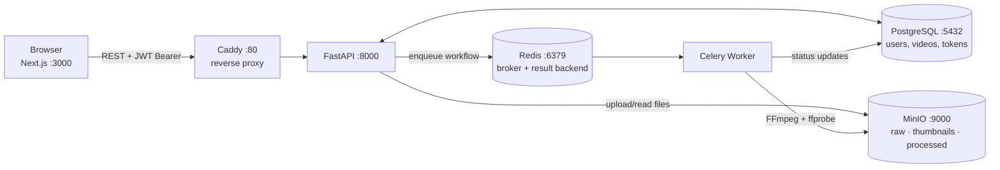

# 01 — Project Overview

Now that your local stack is running, let's take a step back and understand what we actually built — the big picture before we dive into each individual piece.

---

## What This Platform Does

At its core, this is a Video on Demand platform with two kinds of users: **admins** who upload and manage content, and **viewers** who watch it.

An admin logs in, fills out a form with a video's title, description, category, and other metadata, then uploads the video file. The moment the upload completes, a background processing pipeline kicks off automatically. That pipeline downloads the raw file, transcodes it to seven different quality levels (144p through 1440p) in parallel using FFmpeg, splits each quality into six-second segments, generates an HLS playlist, and uploads everything to object storage. By the time that's done — which could be minutes for a long video — a viewer can hit play and the video streams adaptively, choosing the right quality for their connection speed.

A viewer signs up, verifies their email, logs in, and lands on a home feed. They browse videos, click one, and it plays. That's the journey this system is designed to support end-to-end.

---

## Architecture Overview



Two request shapes flow through Caddy: synchronous CRUD/auth calls that FastAPI answers directly against PostgreSQL, and the video-processing path, where FastAPI's only job is to validate the upload, persist the raw file, enqueue a Celery workflow, and return immediately — the actual transcoding happens later, off the request/response cycle entirely.

**Caddy** is the front door. All requests from the browser go through Caddy at port 80. In production, Caddy also handles TLS termination (HTTPS) automatically via Let's Encrypt.

**FastAPI** is the backend API. It handles authentication, video uploads, and database reads/writes. It talks to PostgreSQL for data and MinIO for file storage.

**PostgreSQL** stores everything structured: users, video metadata, auth tokens, email verification records.

**MinIO** is S3-compatible object storage. Raw uploaded videos go in one bucket, thumbnails in another, and processed HLS segments in a third. MinIO is self-hosted — the same code works with real AWS S3 in production.

**Redis** is the message broker for Celery. When FastAPI wants to start processing a video, it drops a task into Redis. The Celery worker picks it up.

**Celery Worker** runs the video processing pipeline — FFmpeg transcoding, HLS segmentation, MinIO uploads. It runs as a separate process so video processing never blocks the API.

---

## Why These Technologies?

Every choice here was deliberate. Here's the reasoning:

**FastAPI over Django or Flask** — FastAPI auto-generates interactive API documentation from your code (the Swagger UI at `/docs`). Its dependency injection system is clean, and Pydantic handles request/response validation with full TypeScript-compatible schema generation. For a data-heavy API, this saves significant boilerplate.

**Celery over in-process threads** — Transcoding a video takes minutes and is CPU-intensive. Blocking an HTTP request for that long would time out and fail. Celery runs the work in a separate process with its own memory, supports automatic retries, and can scale horizontally by adding more worker containers. The API stays fast; the workers do the heavy lifting.

**MinIO over a local filesystem** — Object storage is the right abstraction for video files: immutable blobs identified by a path. MinIO is S3-compatible, which means the same client code works with AWS S3 in production — just change the endpoint URL. No code changes needed to go from self-hosted to cloud.

**HLS over serving raw MP4** — HTTP Live Streaming splits a video into small chunks and lets the player switch quality levels mid-stream based on available bandwidth. A viewer on a slow connection gets 360p; the same viewer on WiFi gets 1080p — automatically. HLS is also required for iOS video playback, and it's CDN-friendly (just static files).

**Next.js App Router** — Server components for better performance, file-based routing with route groups, and first-class TypeScript support. The App Router's layout nesting lets us apply different guards to public vs. authenticated routes cleanly.

**Zustand for auth state** — Simpler than Redux for this use case. Global auth state (is the user logged in? who are they?) is exactly the kind of shared client state Zustand is built for. The Redux DevTools integration is a bonus.

---

## The Full Data Flow: Upload to Playback

Here's the complete journey a video takes:

1. **Admin submits the upload form** — the frontend sends a `POST /videos/create` request with `multipart/form-data` containing the video file, optional thumbnail, and metadata (title, category, etc.) encoded as a JSON string in a form field.
2. **API validates and stores** — FastAPI validates the files, uploads the raw video to MinIO's raw bucket, saves the video metadata to PostgreSQL with `processing_status = "queued"`, then enqueues a Celery workflow task and returns the new video record immediately.
3. **Frontend polls for status** — the upload page opens a progress dialog that calls `GET /videos/{id}/status` every 3 seconds to track processing.
4. **Worker downloads and prepares** — the Celery worker picks up the task, downloads the raw video from MinIO to a local temp directory, and extracts metadata (resolution, duration, codec) using FFprobe.
5. **Storyboard generation** — before transcoding starts, a `generate_storyboard` task tiles the source video into sprite-sheet images (one frame every 5 seconds) and writes a WebVTT file mapping timestamps to sprite coordinates. This is what powers the scrubbing-preview thumbnails on the watch page's timeline. It's best-effort: any failure here is logged and swallowed, never blocking the rest of the pipeline.
6. **Parallel transcoding** — seven FFmpeg processes run in parallel (via Celery's `chord`/`group` primitives, one parameterized `transcode_quality` task invoked once per quality), each transcoding the video to a different quality level: 1440p, 1080p, 720p, 480p, 360p, 240p, and 144p. 4K (2160p) is available but commented out to speed up dev.
7. **HLS segmentation** — each quality's MP4 is split into 6-second `.ts` segments with a `.m3u8` playlist file.
8. **Manifest creation** — a master `.m3u8` playlist is created that references all the quality-specific playlists. This is what the video player loads first.
9. **Upload to MinIO** — all HLS files (master manifest, quality playlists, thousands of segment files) are uploaded to MinIO's processed bucket.
10. **Finalization** — the database record is updated to `processing_status = "completed"` with the manifest URL. Temp files are deleted.
11. **Viewer plays the video** — the browse feed and watch page are public routes; no sign-in is required to watch. The watch page loads the master manifest URL into a custom `@videojs/react`-based player, which handles adaptive HLS quality switching and renders the scrubbing-preview thumbnails parsed from the storyboard WebVTT.

---

## What's Done vs. What's Not

This is important for anyone resuming work on this project. The platform has reached **MVP**: a viewer can land on the site with no account, browse real uploaded videos, and watch them with adaptive-quality HLS playback and scrubbing thumbnail previews. An admin can log in, upload a video, and manage its full lifecycle. The backend has been production-grade since early on; the frontend's core viewer and admin-video journeys are now real and API-wired. What remains is genuinely secondary: comments, watch history, admin user/analytics management, and a handful of documented bugs and gaps (see [13_KNOWN_BUGS_AND_NEXT_STEPS.md](./13_KNOWN_BUGS_AND_NEXT_STEPS.md) for the exhaustive, current list).

**Done and working:**
- Full auth system: signup, email verification, signin, token refresh, logout, password reset
- Video upload endpoint with MinIO integration
- Complete Celery processing pipeline (storyboard generation + all 6 transcoding/packaging stages)
- Public browse feed and watch page — real API data, no mock content, no sign-in required
- Real video playback — custom `@videojs/react` player with adaptive HLS quality and scrubbing-preview thumbnails
- Admin video management: upload, list/filter/sort/paginate, edit details, toggle public/private visibility, soft delete, presigned-URL download
- Frontend auth pages (all auth flows work end to end)
- Frontend video upload form with real-time processing status

**UI built but mocked or half-wired:**
- Comments section on the watch page — real UI, hardcoded comment data, no backend
- `incrementVideoView` — implemented and anonymous-friendly on the backend, but the frontend watch page never calls it, so view counts don't actually move yet
- "Save Draft" in the upload form — still a fake delay; a real `saveDraft()` frontend function exists but points at a backend route (`POST /videos/draft`) that doesn't exist
- All AI features (scene timeline, mood analysis, recommendations, etc.) — fully designed components, all hardcoded data, and as of the design-system migration no longer even imported into any page (orphaned files, not rendered anywhere)
- Admin analytics, users, and settings pages — UI only, no backing endpoints (categories management is real, backed by a shared icon registry, but categories themselves are still a string field on `Video`, not a database table)

**Not started:**
- Comments backend (table + endpoints)
- Watch history (no backend) — also the prerequisite for any real recommendations
- Admin user-management backend (`GET /admin/users` and friends don't exist)
- Google OAuth (the button was removed entirely during the auth redesign — there's nothing to wire up, it would need to be rebuilt)
- Real analytics endpoints

---

## Backend Structure (`backend/app/`)

```
apis/routes/      ← HTTP endpoints: auth, video, user, health
services/         ← Business logic: auth_service, video_service, minio_service, ffmpeg_service
models/           ← SQLAlchemy ORM models (database tables)
schemas/          ← Pydantic schemas (request/response validation)
tasks/            ← Celery tasks (video_tasks.py) and workflow builder (workflows.py)
core/             ← database.py, config.py, jwt.py, security.py, dependencies.py
```

## Frontend Structure (`app/`)

```
app/(public)/           ← No login required
  auth/                 ← sign-in, sign-up, verify-email, forgot/reset password
  (browse)/             ← The video feed — this IS the root page ("/")
    page.tsx            ← Home/browse feed
    watch/[video_id]/   ← Watch page, public — /watch/[video_id]
app/(protected)/        ← Client-side auth-guarded — admin only
  admin/                ← Admin panel (videos, users, analytics, etc.)
lib/apis/               ← Typed API functions using the shared Axios client
lib/store/              ← Zustand stores (authStore is the main one)
hooks/                  ← Custom React hooks (useVideoProcessing for polling, useRequireAuth for action-gating)
```

This route layout is the result of a deliberate restructure: content is public, actions require auth (the YouTube model, not the Netflix one). Browsing and watching never touch an auth check; only reaching `/admin` or performing a gated action (like, comment, follow, watchlist) does.

---

## Key Architectural Decisions (Don't Skip This)

A few choices that will save you debugging time:

- **Sync SQLAlchemy everywhere** — we use `psycopg2` (sync driver), not `asyncpg`. Mixing asyncpg with sync `create_engine` causes `MissingGreenlet` crashes. Don't switch to async SQLAlchemy without understanding this.
- **`Base.metadata.create_all()` runs on startup** — for dev convenience, tables are created/verified on every API startup. This is idempotent (safe to run repeatedly). Alembic handles versioned schema changes.
- **JWT tokens in localStorage** — simpler to implement than httpOnly cookies, but more exposed to XSS. This is a known tradeoff documented in the Known Issues doc.
- **Video upload uses multipart form-data with a JSON string** — the `data` field in the upload request is a JSON-serialized string (not a JSON body). This is because HTTP multipart doesn't cleanly support mixing file fields with JSON objects.

---

## Future Upgrades

As the platform grows: move to async SQLAlchemy for better concurrency, add a CDN in front of MinIO for video delivery, implement database connection pooling via PgBouncer, add rate limiting on API endpoints, and consider breaking the monolithic FastAPI app into separate services for auth, video management, and streaming.

---

## What's Next

The overview gave you the big picture. Now let's go deeper into the infrastructure — each Docker service, how they're configured, and how they communicate with each other.
