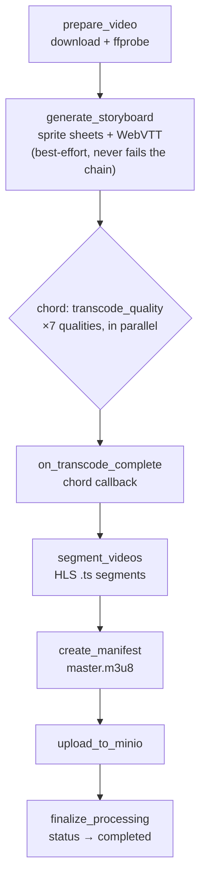

# 06 - Video Processing Pipeline

The raw video is uploaded. Now begins the most complex and CPU-intensive part of the entire system: the background processing pipeline. This document walks through every stage - what it does, why it's designed that way, and what can go wrong.

---

## Why a Background Pipeline?

Transcoding a one-hour video to seven quality levels takes minutes of CPU time, even on powerful hardware. You can't do that in an HTTP request - the connection would time out, the user's browser would give up, and you'd have no way to report progress.

The solution: as soon as the upload finishes, the API enqueues a job and returns immediately. A separate Celery worker process picks up the job and does the heavy lifting. The frontend polls a status endpoint every 3 seconds to show progress.

Celery was chosen for this because:
- It runs in a completely separate process (no blocking the API)
- It supports complex workflow primitives (run tasks in parallel, then run a callback when all complete)
- It handles retries automatically
- It has Flower, a built-in dashboard at http://localhost:5555

---

## The Workflow

Defined in `backend/app/tasks/workflows.py`. The full pipeline is a Celery chain:

```python
workflow = chain(
    prepare_video.s(video_id),
    generate_storyboard.s(),
    chord(
        group(
            # transcode_quality.s("2160p"),  # 4K - commented out, testing takes too long
            transcode_quality.s("1440p"),
            transcode_quality.s("1080p"),
            transcode_quality.s("720p"),
            transcode_quality.s("480p"),
            transcode_quality.s("360p"),
            transcode_quality.s("240p"),
            transcode_quality.s("144p"),
        ),
        on_transcode_complete.s()
    ),
    segment_videos.s(),
    create_manifest.s(),
    upload_to_minio.s(),
    finalize_processing.s()
)
```

This is sequential at the top level - each stage runs after the previous one completes - except for the transcoding step, which runs all seven quality levels in parallel simultaneously (via `chord` + `group`). Note that transcoding is now a single **parameterized** task, `transcode_quality`, invoked once per quality level with a string argument (`"1440p"`, `"1080p"`, ...) - earlier revisions of this pipeline had seven separate task functions (`transcode_1440p`, `transcode_1080p`, etc.); they were consolidated into one task. 4K (2160p) transcoding is commented out to speed up local development.



Let's walk through each stage.

---

## Stage 1: `prepare_video` (status: `preparing`)

**Task:** `backend/app/tasks/video_tasks.py` → `prepare_video`

This task:
1. Updates `processing_status` to `"preparing"`
2. Downloads the raw video from MinIO to a local temp directory (`<backend-dir>/tmp/video_processing/{video_id}/` - not filesystem `/tmp`; the path comes from `settings.processing_temp_dir`, which resolves relative to the backend project directory)
3. Runs `ffprobe` on the file to extract metadata: codec, duration (seconds), resolution (width × height), bitrate
4. Saves this metadata to `video.processing_metadata` as a JSON object
5. Determines which quality levels to transcode - skips any quality higher than the source resolution (no upscaling; transcoding 480p source to 1440p makes no sense)

The task decorator sets `max_requests=3`, which reads like a retry-count kwarg but isn't a recognized Celery option at all - Celery silently accepts and ignores it. The actual retry ceiling comes from Celery's own default `max_retries=3` (never explicitly set on this task), which only coincidentally matches the number in `max_requests=3`. Every retry across this whole pipeline uses a fixed `countdown=60` - there's no exponential backoff anywhere in the codebase, despite what you might expect from typical Celery setups.

---

## Stage 1.5: `generate_storyboard` (scrubbing-preview thumbnails)

**Task:** `backend/app/tasks/video_tasks.py` → `generate_storyboard`

This runs immediately after `prepare_video` and before the transcode chord - it only needs the raw downloaded file and the `duration_seconds` that `prepare_video` already extracted, so it doesn't wait on any transcoded output. It produces the same kind of scrubbing thumbnail strip you'd see hovering the timeline on YouTube or Netflix.

FFmpeg tiles the source video into sprite sheets, sampling one frame every 5 seconds:

```bash
ffmpeg -i <input> -vf "fps=1/5,scale=160:-2,tile=10x10" \
  -vsync 0 -start_number 0 -q:v 4 sprite_%03d.jpg
```

Each sheet holds a 10×10 grid (100 tiles); once a sheet fills, FFmpeg's `image2` muxer automatically rolls over into the next numbered sheet. The task then runs `ffprobe` on the first sheet to measure the *actual* tile pixel dimensions - `scale=160:-2` rounds height to preserve aspect ratio, and getting that rounding wrong by even a pixel would silently misalign every cue's crop coordinates, so the code measures rather than computes. It then writes a `storyboard.vtt` file with one cue per 5-second window:

```
WEBVTT

00:00:00.000 --> 00:00:05.000
sprite_000.jpg#xywh=0,0,160,90

00:00:05.000 --> 00:00:10.000
sprite_000.jpg#xywh=160,0,160,90
```

All sprite sheets and the VTT file are uploaded to the thumbnails MinIO bucket at `{video_id}/storyboard/...`, and `video.storyboard_url` is set to the VTT's object path.

**This stage is best-effort by design.** Its entire body runs inside one `try/except Exception` that logs a warning and returns the pipeline's data unchanged on any failure - modeled on `transcode_quality`'s "skip, don't break the workflow" pattern, deliberately *not* on `segment_videos`/`create_manifest`, which raise and fail the whole pipeline. A missing scrubbing preview is a cosmetic gap; a broken transcode is not. Existing videos processed before this stage existed are not backfilled - `storyboard_url` is simply `null` for them, and the player renders without a preview strip in that case.

On the frontend, the watch page's player fetches this VTT and hand-parses its cues itself (`useStoryboardThumbnails`) rather than relying on a `<track kind="metadata">` element - the design spec originally proposed the `<track>` approach, but it proved unreliable against a cross-origin storage host in practice. See [09_FRONTEND_HOME_AND_WATCH.md](./09_FRONTEND_HOME_AND_WATCH.md) for the player side of this feature.

---

## Stage 2: Parallel Transcoding (status: `transcoding`)

Seven calls to the same task, `transcode_quality(self, data, quality)`, run in parallel via Celery's `group` primitive - parameterized by a quality-name string (`"1440p"`, `"1080p"`, ...), not seven separate task functions. There is no `transcode_1440p`/`transcode_1080p`/etc. anywhere in the codebase; if you see that claim elsewhere, it describes an earlier, pre-consolidation version of this pipeline that no longer exists.

Each call uses settings from `config.QUALITY_SETTINGS`, which looks like:

```python
QUALITY_SETTINGS = {
    "2160p": {"width": 3840, "height": 2160, "bitrate": "20000k"},  # 4K, not currently invoked
    "1440p": {"width": 2560, "height": 1440, "bitrate": "10000k"},
    "1080p": {"width": 1920, "height": 1080, "bitrate": "5000k"},
    "720p":  {"width": 1280, "height": 720,  "bitrate": "2500k"},
    "480p":  {"width": 854,  "height": 480,  "bitrate": "1000k"},
    "360p":  {"width": 640,  "height": 360,  "bitrate": "500k"},
    "240p":  {"width": 426,  "height": 240,  "bitrate": "300k"},
    "144p":  {"width": 256,  "height": 144,  "bitrate": "200k"},
}
```

Note there's a single `bitrate` per quality, not separate video/audio bitrates - audio is hardcoded to `128k` for every quality level.

The FFmpeg command for each quality is roughly:
```bash
ffmpeg -i input.mp4 \
  -vf scale={width}:{height}:force_original_aspect_ratio=decrease,pad={width}:{height}:color=black \
  -c:v libx264 -b:v {bitrate} \
  -c:a aac -b:a 128k \
  -preset medium \
  -threads {FFMPEG_THREADS} \
  output_{quality}.mp4
```

H.264 codec is used for maximum compatibility. The scale filter preserves the source's aspect ratio and pads to fill the target frame with black bars, rather than stretching - a source with a different aspect ratio than the target quality won't come out distorted. `FFMPEG_THREADS` is a fixed constant (`2`), not adaptive to the host's CPU count.

---

## Stage 2.5: `on_transcode_complete` (Chord Callback - status: `aggregating`)

This is the callback of the `chord`, signature `on_transcode_complete(self, results: list)`. When ALL parallel transcoding tasks complete, this task runs with the list of their results.

```python
successful_results = [r for r in results if r is not None and not r.get('skipped', False)]

if not successful_results:
    logger.error("All transcoding tasks failed!")
    with get_db_session() as db:
        update_video_processing_status(db, video_id, "Failed", "All transcoding tasks failed!")
    raise Exception("No successful transcodes - cannot continue workflow")

video_id = successful_results[0]['video_id']
```

**Known bug, still live:** `video_id` is only assigned on the line *after* the `if not successful_results:` block - but that block itself references `video_id` when every quality fails. The intended behavior (log a clean `"failed"` status, then raise) never gets that far: Python raises `NameError: name 'video_id' is not defined` first, so a total transcoding failure surfaces as an unhandled exception in Celery instead of a tidy failed-status update. This only triggers when all 7 quality levels fail simultaneously - rare (a corrupted source file is the realistic trigger), but confirmed still present. The fix is to pull `video_id` out of the first result *before* the failure check, e.g. `video_id = results[0]['video_id'] if results else None`.

---

## Stage 3: `segment_videos` (status: `segmenting`)

Takes each transcoded MP4 and splits it into 6-second `.ts` segments using FFmpeg:

```bash
ffmpeg -i {quality}.mp4 \
  -c copy \
  -f hls \
  -hls_time 6 \
  -hls_list_size 0 \
  -hls_segment_filename {quality}/segment_%4d.ts \
  {quality}/playlist.m3u8
```

6 seconds is the standard HLS segment duration - short enough for the player to switch quality levels quickly, long enough that the number of segments doesn't become unmanageable. The `-c copy` flag means no re-encoding happens here (just demuxing), so this stage is fast.

The output for a 10-minute video at one quality level: ~100 segment files (`segment_000.ts` through `segment_099.ts`) and a `playlist.m3u8` that lists them all.

---

## Stage 4: `create_manifest` (status: `creating_manifest`)

Creates the **master manifest**: a single `master.m3u8` file that lists all the quality-specific playlists and their bandwidth. This is the file the video player loads first.

```m3u8
#EXTM3U
#EXT-X-VERSION:3
#EXT-X-STREAM-INF:BANDWIDTH=8000000,RESOLUTION=2560x1440
1440p/playlist.m3u8
#EXT-X-STREAM-INF:BANDWIDTH=5000000,RESOLUTION=1920x1080
1080p/playlist.m3u8
...
```

When a player (like HLS.js) loads this file, it picks the quality level that matches the viewer's connection speed and resolution. It can switch mid-playback if bandwidth changes.

---

## Stage 5: `upload_to_minio` (status: `uploading_to_storage`)

Uploads everything from the temp directory to MinIO's processed bucket:

```
{video_id}/segments/master.m3u8
{video_id}/segments/1440p/playlist.m3u8
{video_id}/segments/1440p/segment_000.ts
{video_id}/segments/1440p/segment_001.ts
...
{video_id}/segments/144p/playlist.m3u8
{video_id}/segments/144p/segment_000.ts
...
```

For a long video at all quality levels, this could be thousands of files. The upload is done file-by-file with error handling - if any upload fails, the task retries.

The `manifest_url` stored in the database is the MinIO object path to `master.m3u8`, not a full URL. The full URL is constructed at query time from the MinIO endpoint + bucket + object path.

**Known bug, still live:** the status string this stage writes has a space - `"uploading to storage"` - but the `ProcessingStatus` enum value it's meant to match is `uploading_to_storage`, with an underscore. `GET /videos/{id}/status` wraps its enum lookup in a try/except that falls back to `queued` on any mismatch, so while this stage is actually running, the API reports `status: "queued"` at roughly 15% progress instead of `uploading_to_storage` at 90%. It's a cosmetic misreport, not a processing failure - the video still completes normally - but if you're debugging why progress looks like it "jumps backward" near the end of a run, this is why.

---

## Stage 6: `finalize_processing` (status: `finalizing` → `completed`)

The final cleanup step:
1. Updates `video.manifest_url` with the path to `master.m3u8`
2. Updates `video.available_qualities` with the list of successfully transcoded qualities (e.g., `["1440p", "1080p", "720p", "480p", "360p"]`)
3. Updates `video.processing_status` to `"completed"`
4. Clears `video.celery_task_id`
5. Deletes the entire temp directory

This only runs when every earlier stage succeeds. The pipeline is a plain Celery `chain(...)` with no `link_error` handler configured, so when `segment_videos`, `create_manifest`, or `upload_to_minio` marks the video `"failed"` and raises (which each of them does), the chain stops right there - `finalize_processing` does **not** run, and the temp directory is **not** cleaned up on that failure path. The one exception is `transcode_quality`: a failed transcode there returns a value instead of raising, so a chord where every branch fails is the one failure mode that still reaches the rest of the chain (subject to the `on_transcode_complete` bug documented above). If you're chasing disk usage from abandoned temp directories, this is the first place to look.

---

## Error Handling and Failures

Every task catches exceptions and updates `video.processing_status` to `"failed"` with the error message in `video.processing_error`. The frontend's polling hook treats `"failed"` as a terminal state and shows an error to the user.

Retries use a fixed 60-second delay (`countdown=60`), not exponential backoff, across every task in this pipeline. After exhausting retries (3 attempts, Celery's default), the exception propagates and the task is marked as failed in Celery.

Monitor processing in real time via Flower at http://localhost:5555. You can see each task, its status, retry count, and error messages. It's the primary debugging tool for pipeline failures.

---

## Checking Logs During Processing

```bash
make logs s=worker     # Celery worker logs (shows FFmpeg output, stage transitions)
make logs s=api        # API logs (shows task enqueueing, status updates)
```

You can also check MinIO directly at http://localhost:9001 - if processing completed, you should see files under the `processed` bucket at `{video_id}/segments/`.

---

## Future Upgrades

- **Fix the `on_transcode_complete` NameError** - trivial, see Stage 2.5 above
- **Fix the `uploading to storage` / `uploading_to_storage` string mismatch** - see Stage 5 above, another small, self-contained fix
- **Enable 4K transcoding** - uncomment the 2160p step in `workflows.py` (adds significant processing time)
- **Backfill storyboards** - a standalone task/admin action to generate scrubbing thumbnails for videos processed before the storyboard stage existed
- **Configurable storyboard interval/grid** - currently fixed constants (5s interval, 10×10 grid, 160px tiles); could become per-video or per-quality settings
- **`link_error` on the chain** - so `finalize_processing` (or an equivalent cleanup step) actually runs and removes the temp directory even when a stage fails and raises, not just on the happy path
- **Webhook notifications** - push a webhook when processing completes instead of requiring the client to poll
- **Multiple workers** - scale horizontally by running more Celery worker containers
- **Progress percentage** - expose per-stage progress within each task (e.g., FFmpeg progress parsing)
- **Cancel task** - use `celery_task_id` to revoke an in-progress task when a video is deleted
- **Priority queues** - give higher-priority content faster processing
- **Real retry backoff** - replace the fixed 60-second `countdown` with actual exponential backoff

---

## What's Next

The backend pipeline is complete. Now let's cross to the other side: the Next.js frontend. The next document covers the frontend foundation - how the API client works, how auth state is managed, and the architectural decisions that underpin every page.
